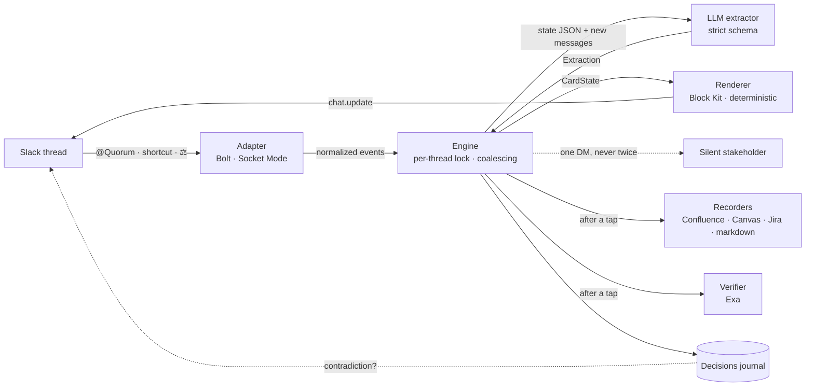

<div align="center">

# ⚖️ Quorum

**An agent with no lines.**
One living decision card. Buttons instead of replies. Inside the thread where your team is already deciding.

[](pyproject.toml)
[](docs/SLACK_APP.md)
[](quorum/llm)
[](tests)
[](docker-compose.yml)

</div>

---

Teams decide things in Slack threads — and then the decision evaporates. Who was for what? Was it actually decided?
Who owns it? Where is it written? Three weeks later someone quietly does the opposite.

Quorum sits in that thread. It **never replies**. It keeps exactly **one message** — a decision card — and edits it as
people talk. It structures the argument instead of joining it: the question, the options, who stands where and why,
what is still open, which facts can be checked, and the deadline. Everything else it does is quiet: a button, an
ephemeral hint, a private DM. Anything that leaves the chat — Confluence, Jira, a public ping — happens only after a
human taps.

> **Every tracked thread ends.** Decided · Parked (why, and when to come back) · Expired (what stayed open).
> Nothing dies silently.

## What it looks like

```
┌──────────────────────────────────────────────────────────────────┐
│ 🗳 Voting · ⏱ Wed 18:00                                          │
│ Postgres or Mongo for the new service?                           │
│                                                                  │
│ Options                                                          │
│  A · Postgres — managed RDS, the team knows it                   │
│  B · Mongo Atlas — flexible schema, higher ops cost              │
│                                                                  │
│ Positions                                                        │
│  @ann → A: "we know it, boring is good"                          │
│  @bob → B ✎: "cheaper ops for us"                                │
│  @cid — no position yet                                          │
│                                                                  │
│ Open questions                                                   │
│  • How much is Atlas M10 in our region? → @cid 📩                │
│                                                                  │
│ Claims to verify                                                 │
│  • "RDS db.t3.medium is ~$60/month" ✅ confirmed · aws.amazon.com │
│                                                                  │
│  [Vote A]  [Vote B]     2/3 voted · A: 1 · B: 1                  │
│  [Confirm decision]  [Back to discussion]                        │
│ updated 1 min ago                                                │
└──────────────────────────────────────────────────────────────────┘
```

## How it works



**The card is a state machine.** `Framing → Deliberating → Voting → Decided → Recorded`, with `Stalled`, `Parked`,
`Expired` on the side and `Superseded` when a later decision replaces it. The LLM never writes the card: it receives
the current state as JSON plus the new messages and returns a new state under a strict schema. Deterministic code
merges it (human corrections win), runs the transitions and renders Block Kit. The card is stable, diffable and tested
without Slack — another messenger is another renderer, not another agent.

| Moment | What Quorum does | What it never does |
|---|---|---|
| Someone mentions it, uses *Track with Quorum*, or reacts ⚖️ | Reads the thread, posts the card at once, fills it in ~5 s | Post a greeting |
| The argument goes on | Edits the card after each burst of messages (4 s coalescing) | Reply in the thread |
| The model misattributed you | *My position* → a modal; your correction is marked ✎ and the model cannot overwrite it | Argue back |
| Someone states a fact | Marks it as a claim; *Verify* runs Exa + a judge, shows a badge and 2–3 sources | Verify on its own |
| A question was addressed to X and X went silent | One DM to X with *Open thread* / *Not mine* | A second DM, a public ping |
| Nobody writes for hours | `Stalled`: the card shows what blocks; the author gets a DM | Let it rot |
| "By Wednesday" | Extracts the deadline; when it comes, opens the vote (reversible, safe) | Decide |
| Everyone voted | DMs the author: confirm | Treat the tally as the decision |
| *Confirm* | Writes the record from the arguments, not the count: what, why, who disagreed, owner, follow-ups | Skip the dissent |
| *Record* | ADR page in Confluence (or Canvas / Jira / markdown), final card broadcast to the channel | Write anywhere without a tap |
| Someone contradicts a past decision | A small notice in that thread: *Link* / *Dispute* → a new thread that supersedes the old one | Stay quiet about it |

## Run it

```bash
cp .env.example .env     # Slack tokens (Socket Mode), OpenAI key; everything else is optional
make env                 # live check of every credential
make up                  # docker compose — no public URL, no ngrok, state in a volume
# or on a laptop:
make install && make run
```

Slack app in two minutes from a manifest: [docs/SLACK_APP.md](docs/SLACK_APP.md).
Demo script: [docs/DEMO.md](docs/DEMO.md). Team guide (RU): [DEVELOPMENT.md](DEVELOPMENT.md).

No `OPENAI_API_KEY`? `make fake` runs the whole thing on a deterministic extractor. `DEMO_TIME_SCALE=60` makes the
timers run sixty times faster for a demo.

## Engineering notes

- **Core without Slack.** Domain model, state machine, merge, engine and renderer are plain Python with tests on a
  fake platform and a fake LLM (`make test`).
- **`ChatPlatform` protocol** — `post_card / update_card / ephemeral / dm / open_form / fetch_thread`; Discord has every
  primitive (threads, components, ephemeral interactions, DMs), so the abstraction is honest.
- **Bolt + Socket Mode**, ack within 3 s, hand-off to the engine in a task; **dedup by `event_id`** (Slack retries),
  `message_changed` / `message_deleted` re-extract; **per-thread queue + coalescing** (no `chat.update` races).
- **Failure handling you can see.** LLM down → the card stays and says *last update failed*; Exa down → *could not
  verify*; Confluence down → retry, then markdown, then the markdown in a DM.
- **Slack cannot move a message.** The card is edited in place; it is re-posted (old one deleted) only on a phase
  change — vote opened, decision confirmed, recorded — so the change is the notification.
- **Plugins, not core.** Exa, Confluence, Jira, Canvas each hide themselves when their key is empty.

## Layout

```
quorum/domain      models · state machine · events · UI primitives
quorum/core        engine (coalescing, buttons/forms, timers, memory) · merge
quorum/llm         protocols · OpenAI structured-output provider · offline fake
quorum/render      Block Kit renderer · ADR markdown
quorum/platform    ChatPlatform protocol · slack/ (Bolt) · fake (tests) · discord/ (next)
quorum/recorders   confluence · canvas · jira · markdown
quorum/verifier    exa
quorum/store       sqlite
docs/              SLACK_APP · CONTRACTS · ACCESS · DEMO
```

<div align="center"><sub>Built for the AI Tinkerers hackathon, Tashkent, September 2026.</sub></div>
